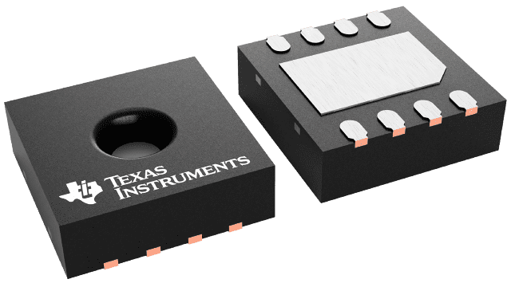
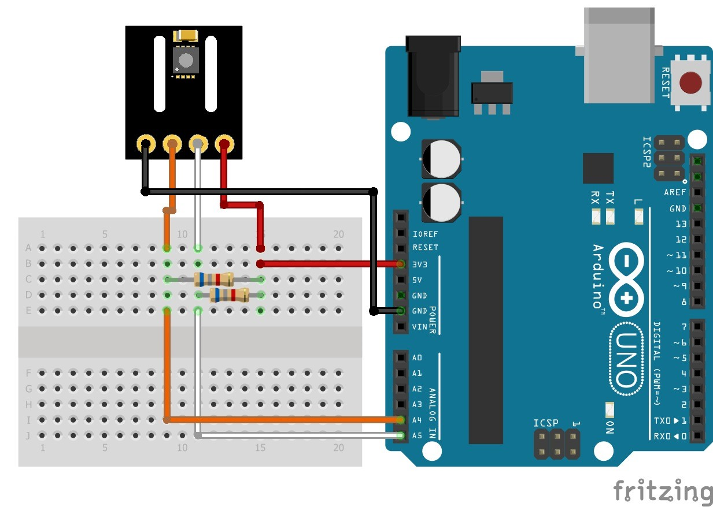
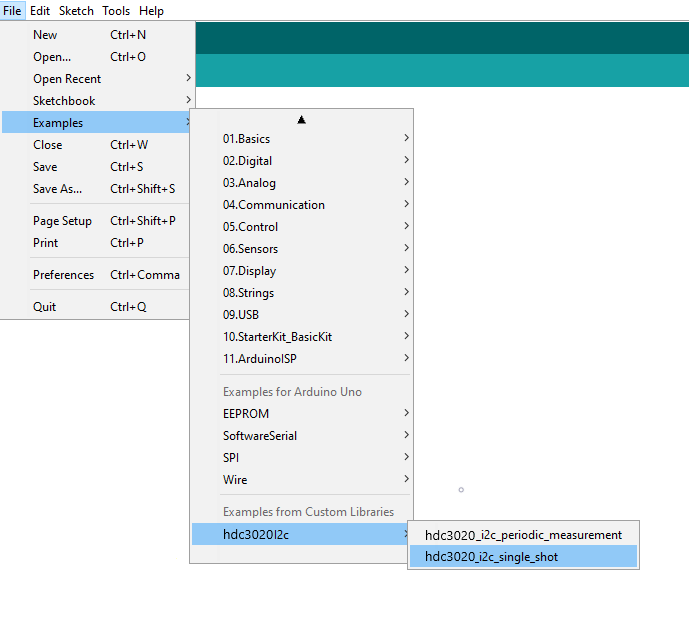

# HDC3020 I2C with Arduino

 

 

## QUICK START GUIDE  

### Components 
- HDC3020
- Arduino
- Breadboard 
- 2 x (1 kΩ - 10 kΩ) pull-ups
- Wire jumper cable  

| Step |                                                                                                                                                             |
|------|-------------------------------------------------------------------------------------------------------------------------------------------------------------|
| 1    |Refer to the provided image (or consult the HDC3020 datasheet for specific pinout details) to connect the sensor module to your Arduino board using jumper wires: __Please note: For this connection scheme the I2C address is 0x44.__   |
| 2    | Download the latest version of the Arduino IDE from the official website:  https://www.arduino.cc/en/software Follow the on-screen instructions to install the IDE on your computer. Version >1.8.7 recommended.                                                            |
| 3    | Download the ZIP File of this project.|
| 4    | Launch the Arduino IDE application on your computer.|
| 5    | Go to:   |
| 6    | Search for the downloaded ZIP File and open it.|
| 7    | Go to: |
| 8    | Connect the Arduino to your PC via the USB cable. Select Board “Arduino Uno” and the appropriate COM-Port from Tools menu and upload the sketch |
| 9    | When the upload is finished, open the the "Serial Monitor" with the key combination (Control + Shift + M) or via the menu bar:    |

### I2C address
The sensor‘s I2C base address is 0x44 (without R/W bit). Pins ADDR and ADDR1 overrule the I2C base address.(for more information check the data sheet)  
  

 

## License 
See [LICENSE](LICENSE).
